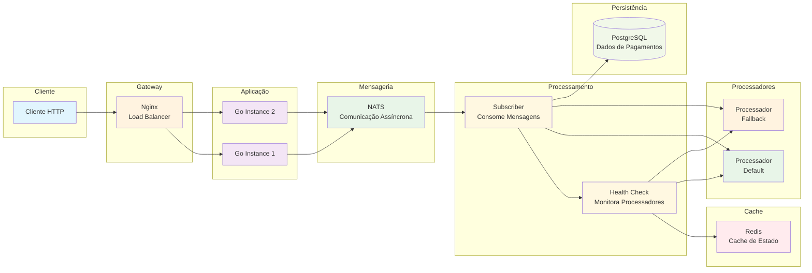

# Rinha de Backend 2025

Sistema de processamento de pagamentos com alta disponibilidade e estratégia de fallback automática.

## 🏗️ Arquitetura

O sistema é composto por uma arquitetura distribuída com os seguintes componentes:

- **API Gateway (Nginx)**: Load balancer que distribui requisições entre múltiplas instâncias da aplicação
- **Aplicação Go**: Múltiplas instâncias (go1, go2) processando pagamentos
- **NATS**: Sistema de mensageria para comunicação assíncrona
- **PostgreSQL**: Banco de dados principal para persistência
- **Redis**: Cache para informações de processadores ativos
- **Processadores de Pagamento**: Sistema externo com fallback automático

Seguindo as requisições do uso de CPU e Memória em:
- 1,5 unidades de CPU
- 350MB de memória

### Limites de Recursos (Docker)
- **Nginx**: 0.15 CPU, 15MB RAM
- **Go Instances**: 0.40 CPU, 60MB RAM cada
- **Redis**: 0.20 CPU, 80MB RAM
- **PostgreSQL**: 0.35 CPU, 135MB RAM

### Dependências Principais
- `github.com/nats-io/nats.go`: Cliente NATS
- `github.com/jackc/pgx/v5`: Driver PostgreSQL
- `github.com/redis/go-redis/v9`: Cliente Redis
- `github.com/nats-io/nats-server/v2`: Servidor NATS embutido

## 🔄 Fluxo do Sistema



> [!NOTE]
> Para uma visualização completa do fluxo do sistema
> consulte os [diagramas detalhados](docs/flow-diagram.md) que incluem sequências de processamento, estratégia de fallback, arquitetura de componentes e estados do sistema.

## 🚀 Como Executar Localmente

### Pré-requisitos
- Docker e Docker Compose
- Go 1.24.5+ (para desenvolvimento local)

### Clone os processors
```bash
> gh repo clone zanfranceschi/rinha-de-backend-2025 rinha-processors

> cd rinha-processors/payment-processor && docker compose up --build
```

### Suba o projeto
```bash
> docker compose up --build
```

### 3. Verificação do Sistema
```bash
# Verificar status dos processadores
curl http://localhost:9999/processors/status

# Enviar pagamento de teste
curl -X POST http://localhost:9999/payments \
  -H "Content-Type: application/json" \
  -d '{
    "correlationId": "123e4567-e89b-12d3-a456-426614174000",
    "amount": 100.50
  }'

# Consultar resumo de pagamentos
curl http://localhost:9999/payments-summary
```

## 🧪 Testes

### Testes de Carga
```bash
# Exemplo com curl para múltiplas requisições
for i in {1..100}; do
  curl -X POST http://localhost:9999/payments \
    -H "Content-Type: application/json" \
    -d "{\"correlationId\": \"$i\", \"amount\": $i.00, \"requestedAt\": \"$(date -u +%Y-%m-%dT%H:%M:%SZ)\"}" &
done
```

## 📊 Endpoints da API

### Produção
- `POST /payments` - Enviar pagamento
- `GET /payments-summary` - Resumo de pagamentos (com filtros opcionais)
- `POST /admin/purge-payments` - Limpar todos os pagamentos

### Desenvolvimento/Testes
- `GET /processors/status` - Status dos processadores ativos
- `GET /payments/{id}` - Detalhes de um pagamento específico

### Parâmetros de Consulta
- `from`: Data/hora inicial (formato flexível)
- `to`: Data/hora final (formato flexível)

Exemplo:
```
GET /payments-summary?from=2024-01-01T00:00:00Z&to=2024-01-31T23:59:59Z
```

## 📝 Licença

Este projeto foi desenvolvido para a Rinha de Backend 2025. 