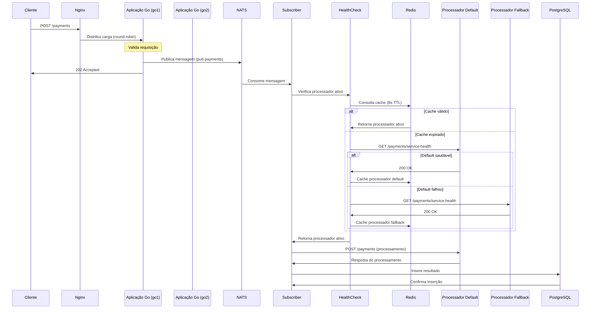
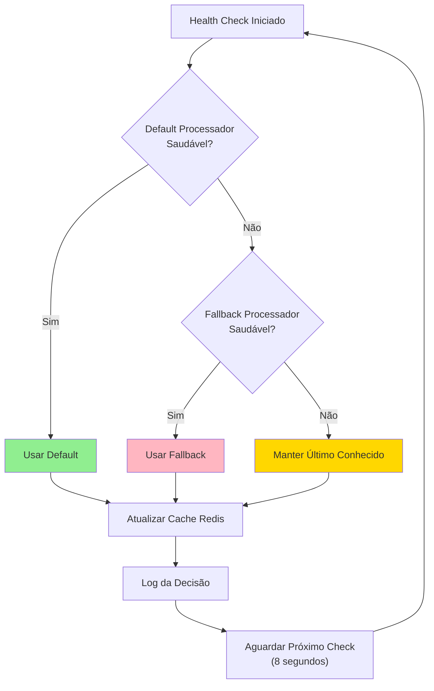
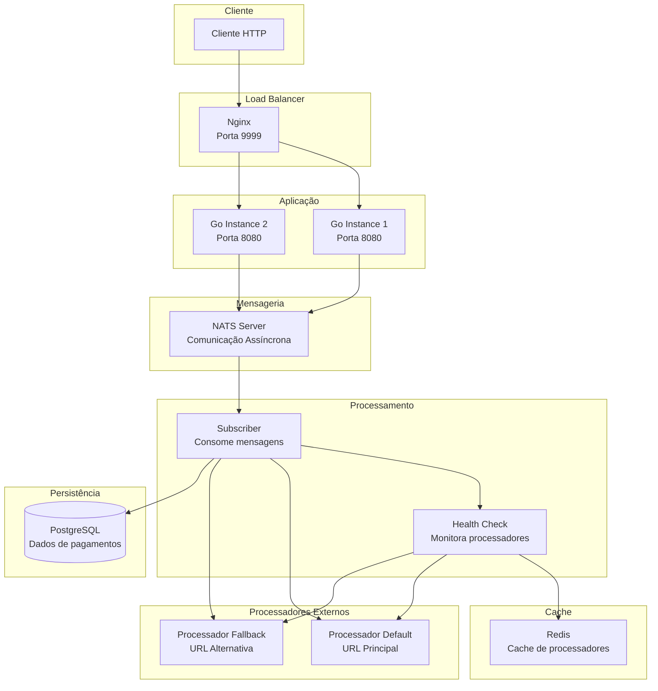
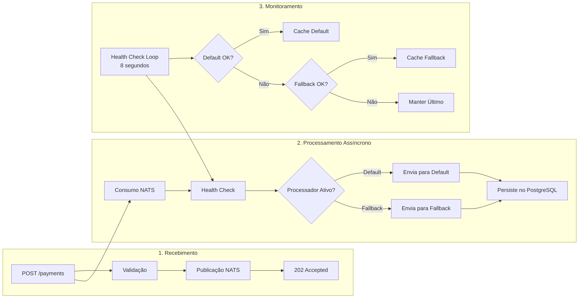
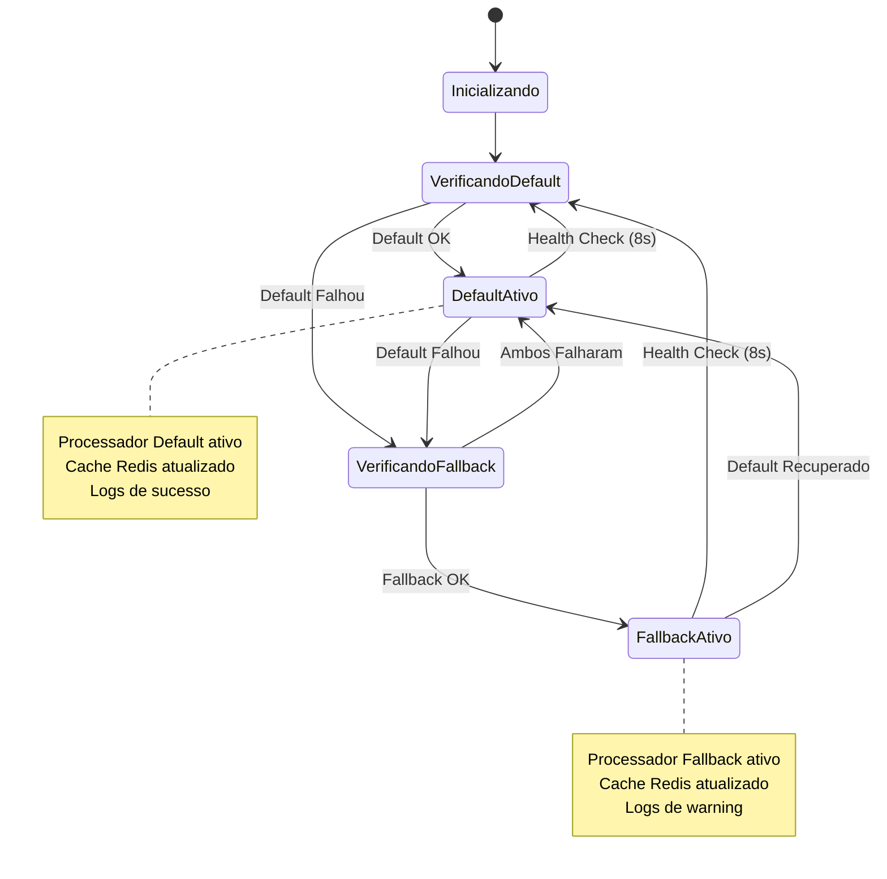
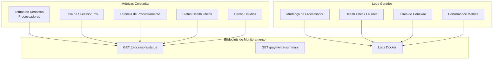

# Diagramas do Fluxo do Sistema

## 🔄 Fluxo Principal de Processamento de Pagamentos

## 🏥 Estratégia de Fallback

## 🏗️ Arquitetura de Componentes

## 📊 Fluxo de Dados Detalhado

## 🔍 Estados do Sistema

## 📈 Métricas e Monitoramento

---

## 📝 Como Usar os Diagramas

Estes diagramas podem ser visualizados em:

1. **GitHub**: Os diagramas Mermaid são renderizados automaticamente
2. **Mermaid Live Editor**: https://mermaid.live/
3. **VS Code**: Com extensão Mermaid Preview
4. **Documentação**: Qualquer ferramenta que suporte Mermaid

## 🔧 Personalização

Para modificar os diagramas:

1. Edite o arquivo `docs/flow-diagram.md`
2. Use a sintaxe Mermaid para criar novos diagramas
3. Teste no Mermaid Live Editor antes de commitar
4. Os diagramas serão atualizados automaticamente no GitHub 